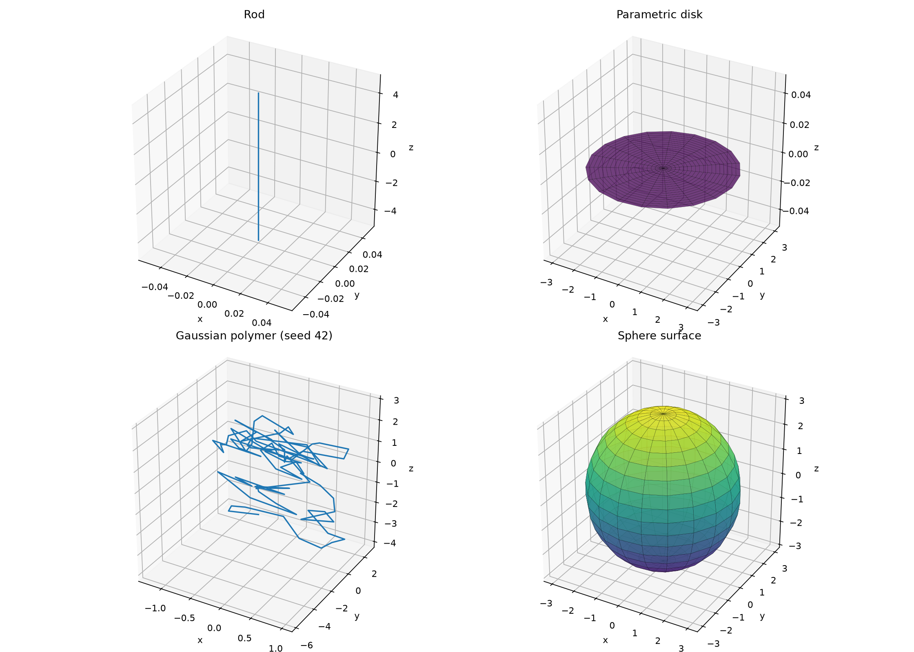

Subunit YAML can describe representative 3D geometry, and a `World` can export
one deterministic realization as OpenUSD. For a complete runnable path from a
user-authored model through world save/reload to `.usda`, start with the
[custom YAML model workflow](tutorials/custom-yaml-workflow.qmd).

## Geometry and reference mappings

Schema version 1 model files may include a `visualization` block.  Geometry is
declared as named `curve`, `surface`, or `random_walk` patches.  Curves use a
bounded `u` domain and XYZ expressions; surfaces use bounded `u` and `v`
domains.  Random walks accept `closure: open` or `closure: bridge` and are
scaled to `target_rg`.  References select fixed positions, curve fractions, or
distributed geometry locations.  Expressions may use model parameters,
visualization definitions, domain variables (`u`, `v`, `t`), constants, and
the standard mathematical functions.

A distributed reference can expose named visualization-only `variants`.  A
reference such as `ends#top#joint7` selects the `top` variant and uses `joint7`
as the deterministic point identity.  The base scattering reference remains
`ends`; the variant affects only the representative visualization.  The legacy
one-label form `ends#joint7` continues to use the reference's normal sampling
rule.

Links constrain positions only.  A labelled distributed reference is sampled
deterministically from the export seed and instance path.  The default
`Random` layout gives each linked child one uniformly random 3D rotation;
geometry overlap is permitted.  This free orientation is only a representative
realization and does not alter pySEB's orientationally averaged scattering
calculation.  Changing the seed produces a different realization.

The optional `Readable` layout evaluates several seeded rotations for each
new child and selects the one with the best clearance from geometry already
placed.  It then performs deterministic relaxation sweeps that rotate complete
descendant subtrees around their external junctions.  These rigid subtree moves
preserve the external junction and every internal link exactly.  Directly
connected geometry participates in collision scoring after masking a small
neighborhood around its intended contact point.

Readable layout never rejects an export when overlap cannot be avoided.
Candidate scoring uses coarse geometry proxies, so this remains deterministic
best-effort layout rather than a collision-free guarantee.  Its USD metadata
identifies the orientations as optimized for readability rather than uniformly
sampled.

The exporter writes a deterministic representative realization as text USDA;
no OpenUSD runtime is required.  Use `.usda` for explicit text or `.usd` when
an interchange tool expects that extension:

```python
options = pyseb.USDExportOptions(pyseb.LengthUnit.Angstrom)
options.seed = 42
options.layout_mode = pyseb.LayoutMode.Readable
options.orientation_trials = 64
options.relaxation_sweeps = 4
options.minimum_clearance = 0.05  # In the selected model length unit.
world.export_usd("structure", "structure.usda", parameters, options)
```

The C++ API is equivalent:

```cpp
USDExportOptions options(LengthUnit::Angstrom);
options.seed = 42;
options.layoutMode = USDLayoutMode::Readable;
options.orientationTrials = 64;
options.relaxationSweeps = 4;
options.minimumClearance = 0.05;
world.ExportUSD("structure", "structure.usda", parameters, options);
```

Curve and surface resolutions default to 96 and 48 samples respectively.
Display color/opacity can be supplied in YAML style defaults or overridden by
full instance path in `USDExportOptions`.  The resulting hierarchy, curves,
meshes, point instancers, and metadata can be opened by Blender or `usdview`.

{fig-alt="Four 3D panels showing a rod curve, parametric disk, random-walk polymer, and sphere surface." width="95%"}

## Interactive examples

The following figures are built from the actual USDA files written by the
maintained Python examples. OpenUSD resolves their transforms and scene
hierarchy during the documentation build; Plotly renders the resulting meshes,
curves, and points in the browser.

```{python}
#| echo: false

from tutorials._helpers import run_usd_example, usd_to_plotly

rod_workspace, rod_usd = run_usd_example(
    "usd_rod_polymer_chain.py",
    "rod_polymer_chain.usda",
)
cloud_workspace, cloud_usd = run_usd_example(
    "usd_debye_cloud_attachment.py",
    "debye_cloud_attachment.usda",
)
cylinder_workspace, cylinder_usd = run_usd_example(
    "usd_cylinder_chain.py",
    "cylinder_chain.usda",
)
spheroid_workspace, spheroid_usd = run_usd_example(
    "usd_spheroid_chain.py",
    "spheroid_chain.usda",
)
polymers_workspace, polymers_usd = run_usd_example(
    "usd_sphere_polymers.py",
    "sphere_polymers.usda",
)
dendrimer_workspace, dendrimer_usd = run_usd_example(
    "usd_contour_linked_rod_dendrimer.py",
    "contour_linked_rod_dendrimer.usda",
)
```

### Curves and readable layout

This alternating chain combines straight parametric curves and seeded
random-walk curves. The readable layout rotates complete linked subtrees while
preserving every end-to-end junction.

```{python}
#| label: fig-interactive-rod-polymer-chain
#| fig-cap: "Interactive OpenUSD realization of an alternating rod–polymer chain."

rod_figure = usd_to_plotly(rod_usd, height=600)
rod_figure.show(config={
    "displaylogo": False,
    "scrollZoom": True,
    "responsive": True,
})
```

### Point instancing and a visual-only envelope

This scene combines a Debye `PointInstancer`, its translucent triangulated
envelope, and a parametric spheroid surface. The envelope is visual-only and
does not contribute to the scattering calculation.

```{python}
#| label: fig-interactive-debye-cloud
#| fig-cap: "Interactive OpenUSD Debye cloud, envelope, and attached spheroid."

cloud_figure = usd_to_plotly(cloud_usd, height=600)
cloud_figure.show(config={
    "displaylogo": False,
    "scrollZoom": True,
    "responsive": True,
})
```

Drag any figure to orbit, scroll to zoom, and hover to inspect resolved USD
paths. The examples execute only while Quarto builds the page; published-page
interaction runs in the browser without a Python server.

## More example structures

These gallery entries are also rendered from their maintained examples rather
than from screenshots.

::: {.grid}
::: {.g-col-12 .g-col-md-6}
```{python}
#| echo: false
#| label: fig-interactive-cylinder-chain
#| fig-cap: "Cylinder chain joined through named opposite-cap variants."

usd_to_plotly(cylinder_usd, height=475).show(config={
    "displaylogo": False,
    "scrollZoom": True,
    "responsive": True,
})
```
:::

::: {.g-col-12 .g-col-md-6}
```{python}
#| echo: false
#| label: fig-interactive-spheroid-chain
#| fig-cap: "Spheroid chain joined north-to-south through fixed references."

usd_to_plotly(spheroid_usd, height=475).show(config={
    "displaylogo": False,
    "scrollZoom": True,
    "responsive": True,
})
```
:::

::: {.g-col-12 .g-col-md-6}
```{python}
#| echo: false
#| label: fig-interactive-sphere-polymers
#| fig-cap: "Gaussian polymers attached to labelled points on a sphere surface."

usd_to_plotly(polymers_usd, height=475).show(config={
    "displaylogo": False,
    "scrollZoom": True,
    "responsive": True,
})
```
:::

::: {.g-col-12 .g-col-md-6}
```{python}
#| echo: false
#| label: fig-interactive-contour-rod-dendrimer
#| fig-cap: "Contour-linked rod dendrimer laid out for readability."

usd_to_plotly(dendrimer_usd, height=475).show(config={
    "displaylogo": False,
    "scrollZoom": True,
    "responsive": True,
})
```
:::
:::

## Maintained examples

For example, a cone needs no C++ registration: define a `surface` patch with
`coordinates: ["(1-u) * R * cos(v)", "(1-u) * R * sin(v)", "u * H"]`,
`u: {lower: 0, upper: 1}`, and `v: {lower: 0, upper: "2*pi"}` in YAML.

The complete sphere-and-rods example is available in
`pyseb/examples/python/usd_sphere_rods.py`.
The corresponding sphere-and-polymers example is in
`pyseb/examples/python/usd_sphere_polymers.py`.
A contour-linked binary rod dendrimer is demonstrated in
`pyseb/examples/python/usd_rod_dendrimer.py`.
The contour-to-contour variant is in
`pyseb/examples/python/usd_contour_linked_rod_dendrimer.py`.
A 100-circle center-to-contour chain is demonstrated in
`pyseb/examples/python/usd_circle_chain.py`.
A 100-sphere center-to-surface chain is demonstrated in
`pyseb/examples/python/usd_sphere_chain.py`.
A 20-cylinder end-to-end chain, selecting opposite cap variants on every
interior cylinder, is demonstrated in
`pyseb/examples/python/usd_cylinder_chain.py`.
An alternating 10-rod/10-polymer chain joined exclusively through `end1` and
`end2` is demonstrated in `pyseb/examples/python/usd_rod_polymer_chain.py`.
A 20-spheroid chain joined from each `north` pole to the next `south` pole is
demonstrated in `pyseb/examples/python/usd_spheroid_chain.py`.
A Debye sphere cloud attached through its named `join` reference to an analytic
spheroid is demonstrated in
`pyseb/examples/python/usd_debye_cloud_attachment.py`.

Debye clouds include a translucent visualization-only envelope by default.
The envelope is a triangulated union of inflated scatterer spheres; automatic
padding connects the cloud while preserving its irregular outline.  Configure
it with `debye_envelope`, `debye_envelope_resolution`,
`debye_envelope_padding` (`-1` selects automatic padding), and
`debye_envelope_opacity` in `USDExportOptions`.  The USD mesh is marked with
`pyseb:visualOnly = true` and contributes no scattering physics.
